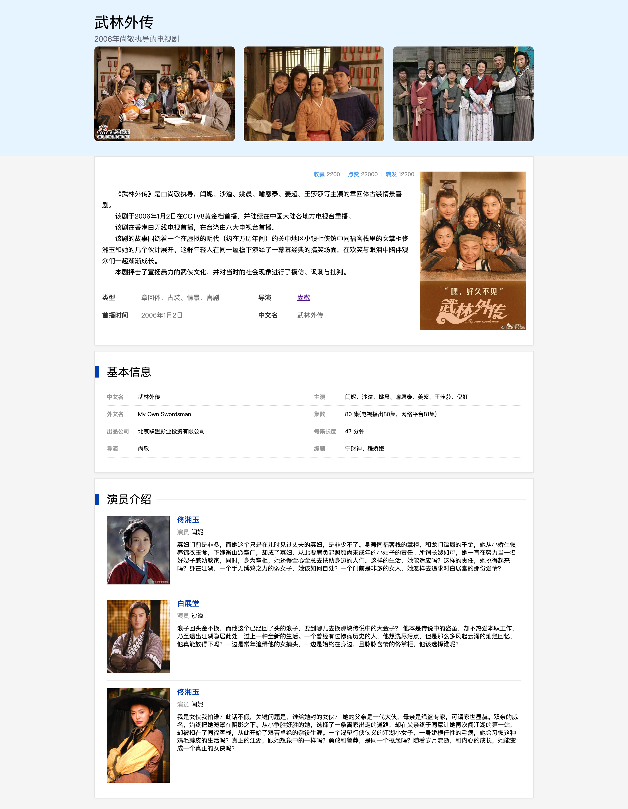

# 任务1：我最喜欢的电视剧（电影）
### 在线预览
[我最喜欢的电视剧（电影）线上预览地址](https://erdong-fe.github.io/FeProject2Dong/01.JavaScript/01.MyFavoriteTV/index.html)
### 截图
实现一个和下图一样的HTML静态页面，主体是“我最喜欢的电视剧（电影）”，选择一个你自己你喜欢的电视剧或电影，展示成图中这样的布局和格式，要求：
1. 页面还原度要尽可能的高
2. 代码必须放在GitHub仓库里
3. 图片和截图不必保持一致

### 技术点
##### HTML
1. 页面的结构划分
2. 如何合理的使用语义化HTML
> [html标签学习](https://www.w3school.com.cn/html/index.asp)
##### CSS
1. flex布局
2. CSS的基本使用
> [30分钟学会flex布局](https://zhuanlan.zhihu.com/p/25303493)