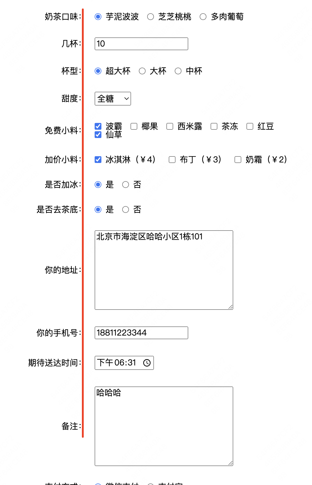
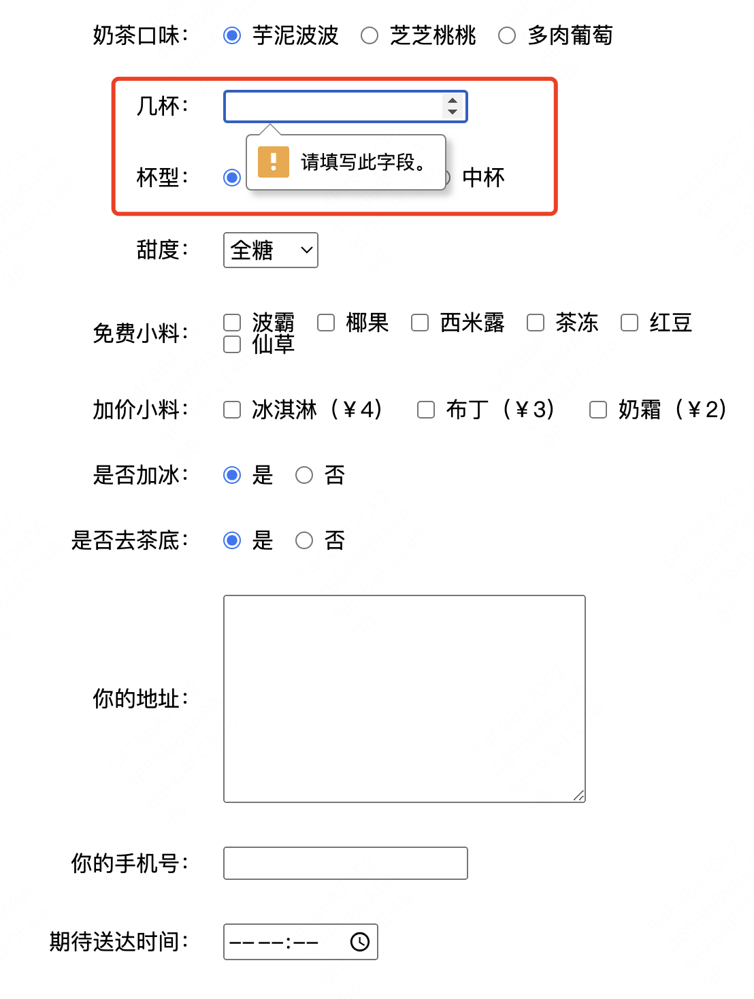
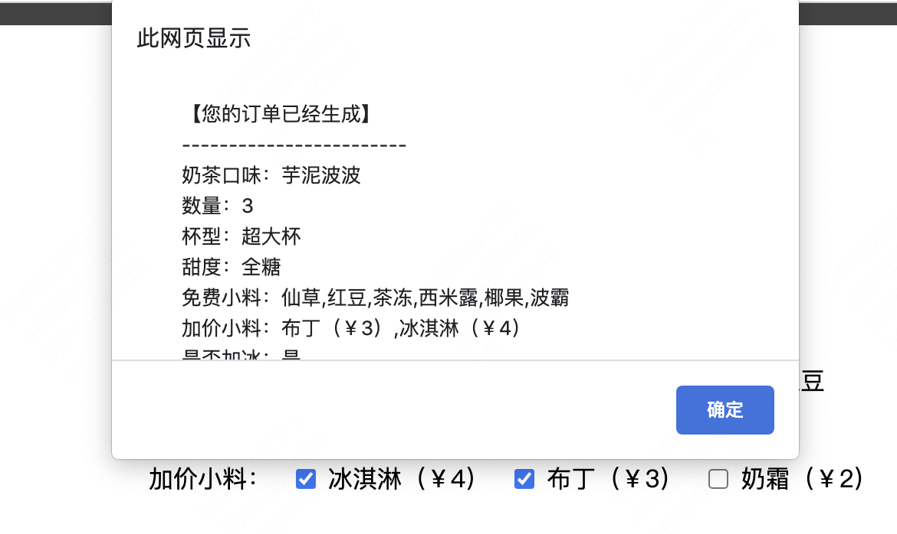
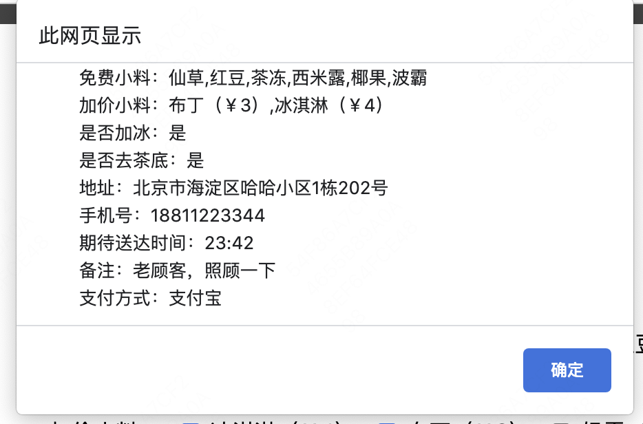
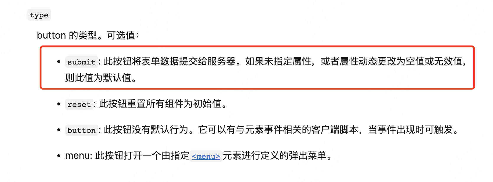
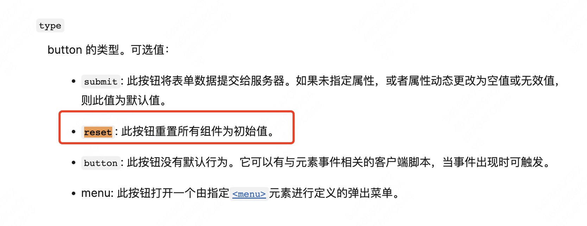
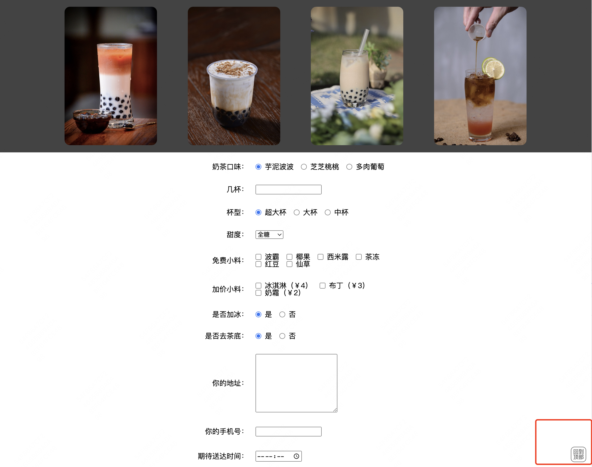
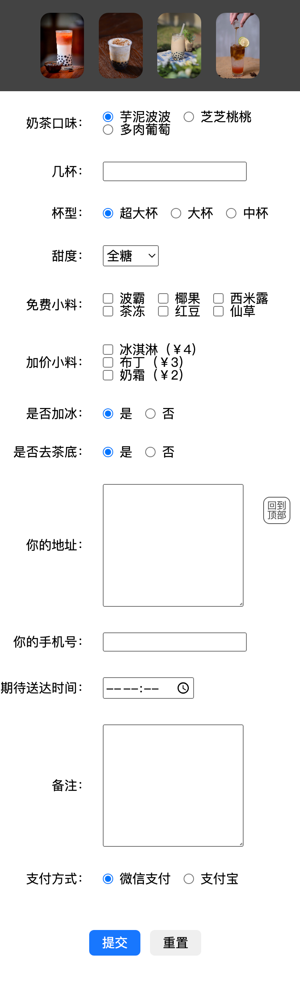

# 任务2：喜东茶-奶茶预订表单
### 在线预览：
[预览链接](https://erdong-fe.github.io/FeProject2Dong/01.JavaScript/02.OrderMilkTea/demo.html)
### 项目要求和学习资料
1. 页面顶部4张奶茶图片，并且鼠标移动到图片上时，图片会有一个角度旋转的效果
    > 参考资料
    > - [hover伪类](https://www.w3school.com.cn/cssref/selector_hover.asp)
    > - [rotate动画](https://www.cnblogs.com/chengxs/p/8066819.html)
2. 按照预览网页写出所有的表单项，并且布局一致，这里有几个注意点：
    1. 注意所有的表单项文字都是对齐的：
        
    > 参考资料
    > - [表单学习资料](https://developer.mozilla.org/zh-CN/docs/Learn/Forms)
    > - [flex布局学习](https://zhuanlan.zhihu.com/p/25303493)
    2. 除过免费小料、加价小料、备注这3项以外，其他项都是必填项，如果没填就点击提交按钮，会有提示：
        
    > 参考资料
    > - [form表单required属性](https://www.runoob.com/tags/att-input-required.html)
3. 点击提交按钮：
    1. 提交完成后弹窗提示本次预定的奶茶信息
        
        
    > 参考资料
    > - [button的submit](https://developer.mozilla.org/zh-CN/docs/Web/HTML/Element/button#%E5%B1%9E%E6%80%A7)
        
    > - [原生js获取表单数据](https://www.zhihu.com/question/586654469)
4. 点击重置按钮：
    1. 重置填写的表单项值
    > 参考数据
    > - [button的reset](https://developer.mozilla.org/zh-CN/docs/Web/HTML/Element/button#%E5%B1%9E%E6%80%A7)
        
5. 回到顶部按钮：
    1. 按钮固定在浏览器视窗的右下角
        
    > 参考资料
    > - [css fixed](https://www.runoob.com/css/css-positioning.html#position-fixed)
    2. 点击“回到顶部”按钮，页面回到顶部
    > 参考资料
    > - [回到顶部功能例子](https://www.runoob.com/w3cnote/js-to-top.html)

### 进阶功能（有时间再做，不强求）
1. 移动端适配
    - 页面适配移动端展示
        
2. 页面本来就在顶部的时候不展示“回到顶部”按钮，只有在页面往下滚动了之后才出现“回到顶部”按钮