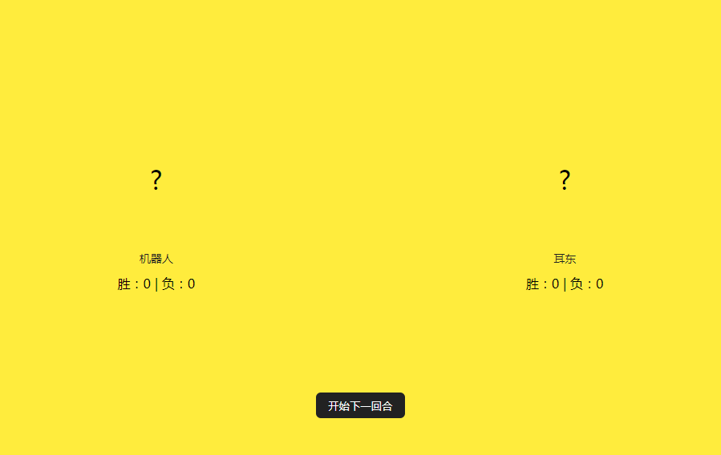
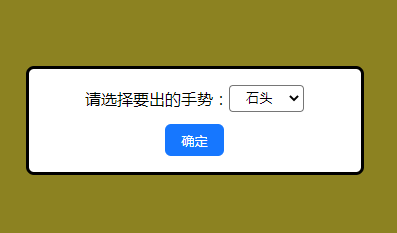
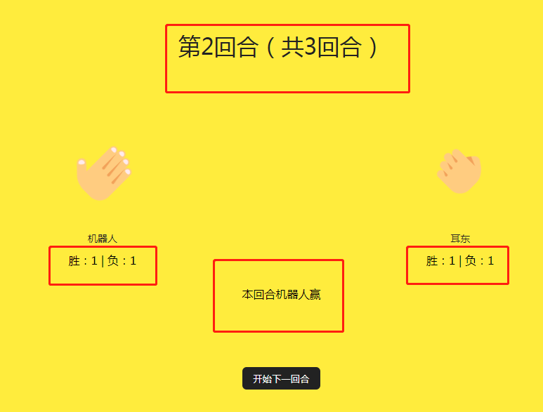
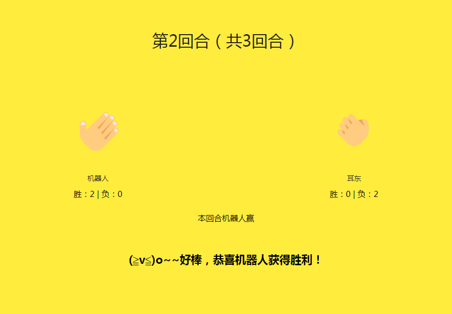

# 任务3：小游戏-石头剪刀布
**该任务有一定难度，大家加油**

任务3是做一个石头剪刀布的小游戏，整个游戏采取三局两胜制，游戏的对手是你和机器人
每次出拳的原则是你这边在石头剪刀布里面选，机器人会在石头剪刀布里随机出一个
判断游戏的结果就是看谁最先达到赢2次，也可能是平局
### 在线预览：
[预览链接](https://erdong-fe.github.io/FeProject2Dong/01javascript/03.RockPaperScissors/demo.html)
### 项目使用知识点：
1. flex布局学习：[链接](https://zhuanlan.zhihu.com/p/25303493)
2. 浏览器的原生弹窗dialog: [链接](https://developer.mozilla.org/en-US/play)
3. javascript生成随机数：[链接](https://www.runoob.com/w3cnote/js-random.html)
4. 替换dom的子元素：[链接](https://developer.mozilla.org/zh-CN/docs/Web/API/Node/replaceChild)
5. 进阶的程序设计能力，这个很重要

### 项目要求
1. 游戏初始化时：
    - 机器人和你的出拳区域都展示为问号
    - 展示出机器人和你的名字
    - 展示出当前的胜负得分
    - 展示出“开始下一回合”的按钮
    
2. 游戏进行中：
    - 点击“开始下一回合”按钮，出现弹窗要求选择要出的手势，下拉选项为：石头、剪刀、布
    
    - 选择完成后点击确定，弹窗关闭，你的出拳区域出现你刚刚选择的出拳图片，机器人出拳区域出现随意的出拳图片
    - 判定本回合的输赢，展示出本回合输赢的文字，并且计算出机器人和你的胜负得分并且展示出来
    - 顶部的文字“第几回合（共3回合）”要随着游戏的进展而变化
    
    - 在游戏进展的过程中要判定游戏的输赢，如果有人已经赢了2次，那游戏结束，如果已经玩了3回合，那游戏结束并判定谁赢或平局，展示出整个游戏的结果，并且隐藏“开始下一回合”的按钮
    
